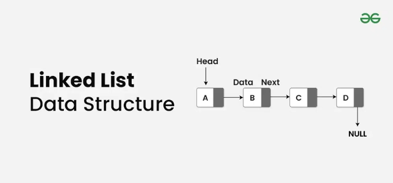

# Linked Lists in JavaScript

## What is a linked list?

> "A linked list is a linear data structure that consists of a series of nodes connected by pointers. Each node contains data and a reference to the next node in the list. Unlike arrays, linked lists allow for efficient insertion or removal of elements from any position in the list, as the nodes are not stored contiguously in memory." - _Geeks for Geeks_

